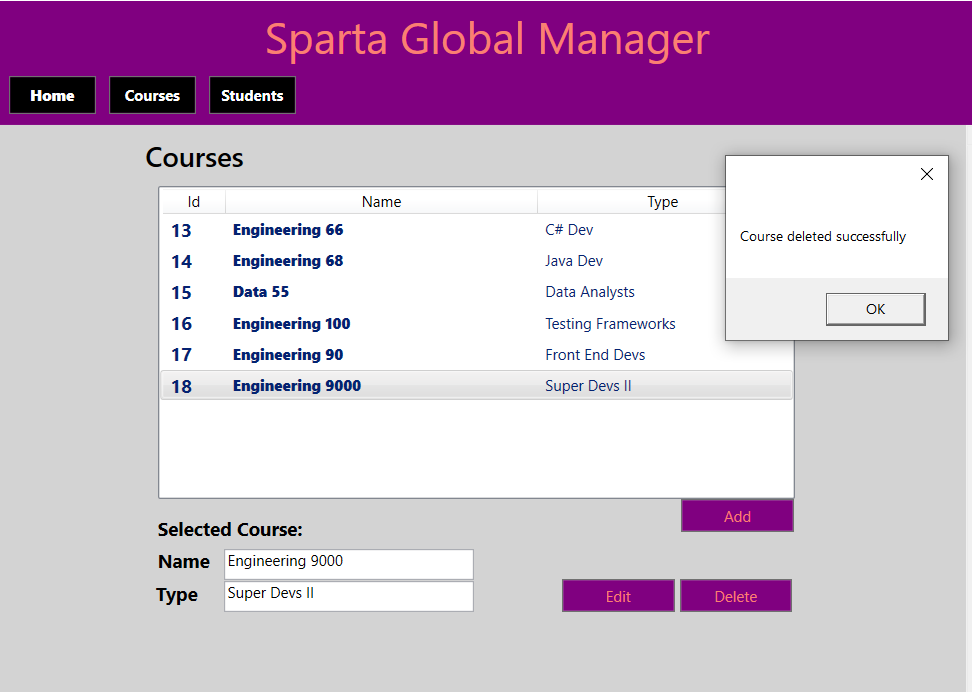
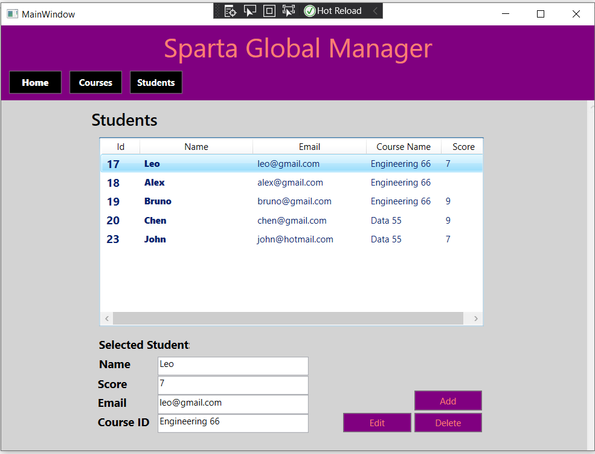

# Sparta Global Manager

## Description
- The application helps the user to manage courses and students
- The application is built in 3 layers, using EntityFramework to create an API, created a client to fetch the API and built CRUD functionalities, displayed the view on WPF
- An user can:
- Get all courses and students
- Add new course and student
- Delete a selected course or student
- Update a selected course or student

## Tech Stack
- Front end: WPF
- Backend: C#
- Database: SQL, EntityFramework

## Screenshots

### Courses

### Students

